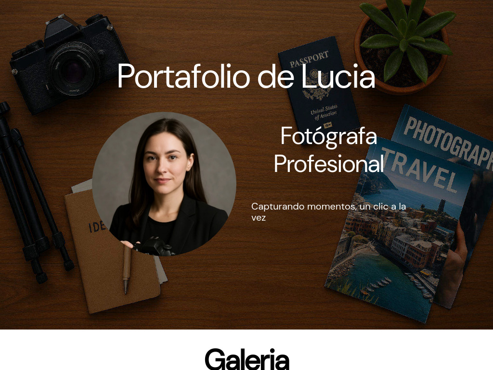

# Portafolio-de-Fotografa

Una página tipo portafolio para una fotógrafa

# Vista Previa 

# Descripción del Proyecto

Para practicar mis conocimientos en HTML5 y CSS le pedí a la inteligencia artificial Grok que tomara el rol de un cliente que quiere una página web y la cree siguiendo las mejores prácticas de desarollo

# Tecnologías Utilizadas

* **HTML5** Para la estructura y contenido de la página
* **CSS3** Para el diseño, estilos y animaciones
  * Se utilizo **Flexbox** y **Grid**
  * Se implemento **Media Queries** para hacer el sitio responsivo

# Ver Proyecto en Vivo

Puedes ver el resultado final aquí: [Enlace al proyecto](https://JaredVD/Portafolio-de-Fotografa/)

# Lo que aprendí

* El uso correcto de etiquetas semánticas de HTML5
* Cómo estructuras un layout complejo con Flexbox y Grid
* Crear diseños responsivos con el enfoque "mobile-first"
* Técnicas de CSS como el uso de variables para los colores y fuentes, y transiciones sutiles para mejorar la experiencia del usuario

# Autor 

* **[Jared Vázquez Díaz]**
* Github: [@JaredVD](https://github.com/JaredVD)
* LinkedIn: [Mi perfil de LinkedIn](https://www.linkedin.com/in/jared-v%C3%A1zquez-d%C3%ADaz/)

